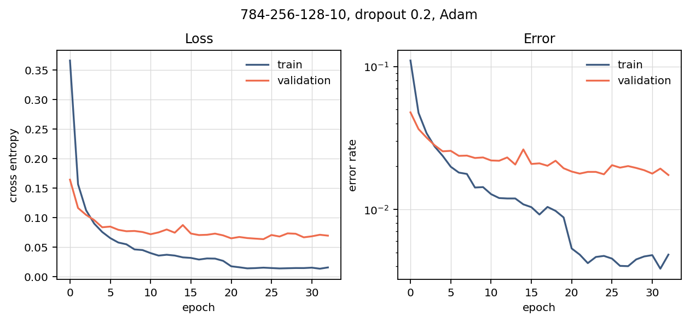
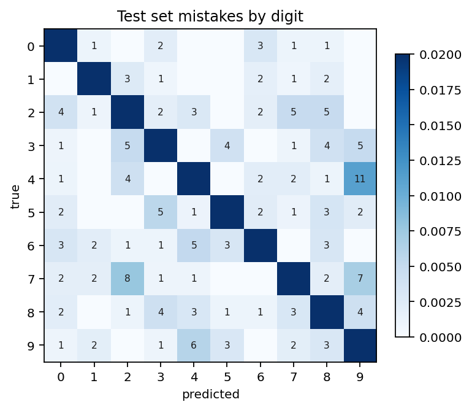
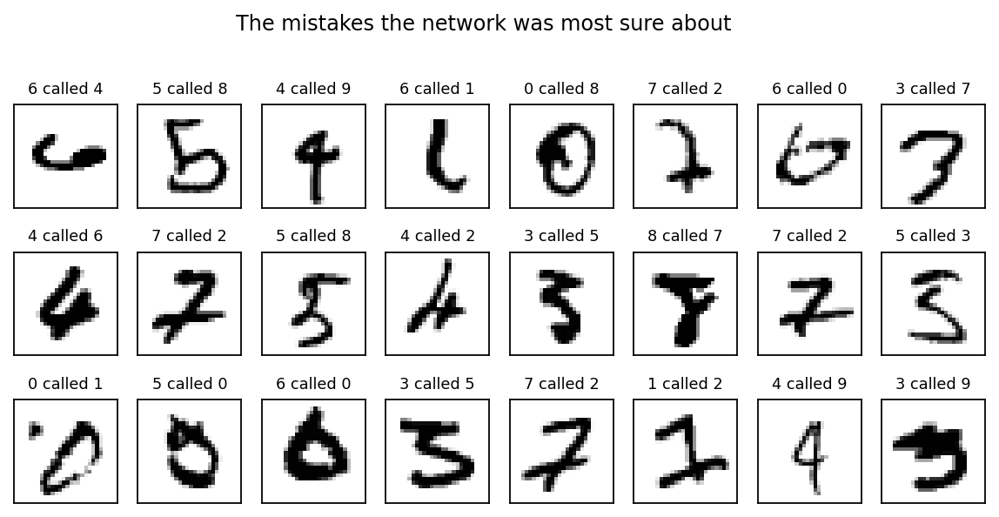
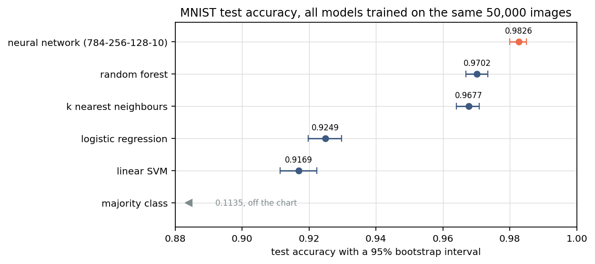
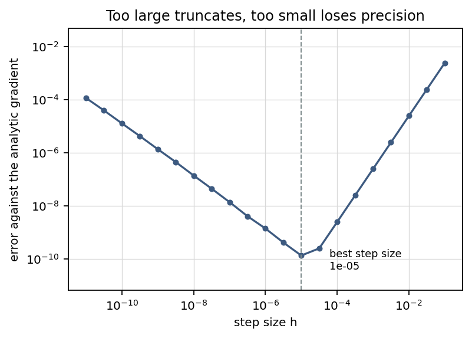
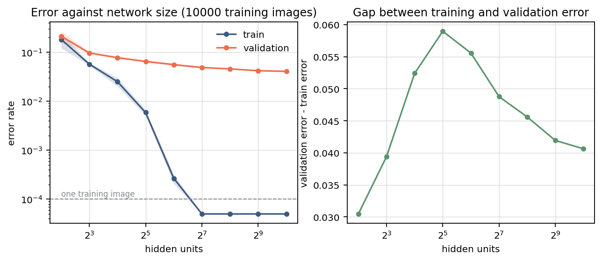
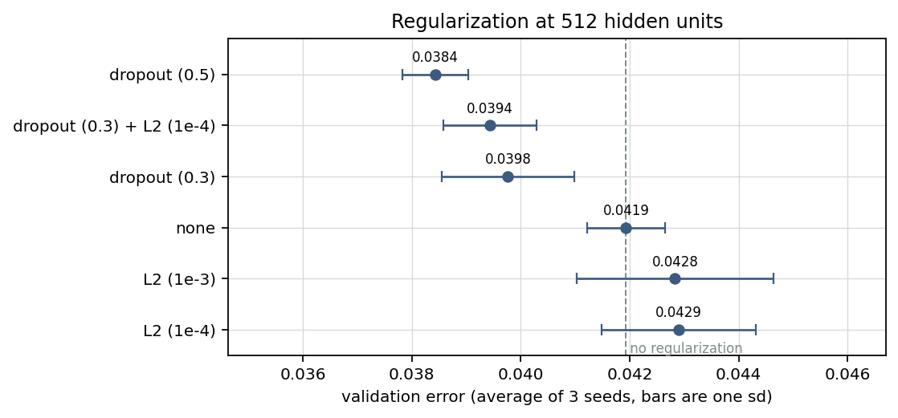
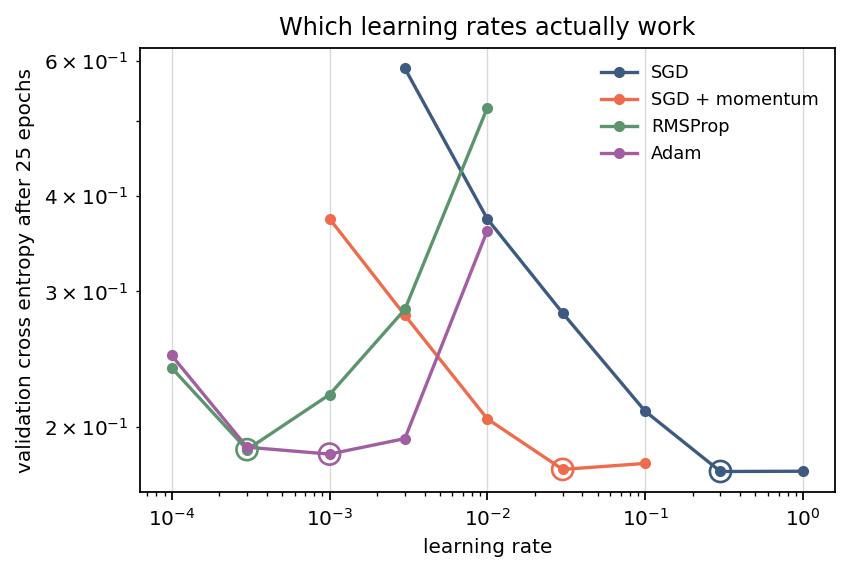
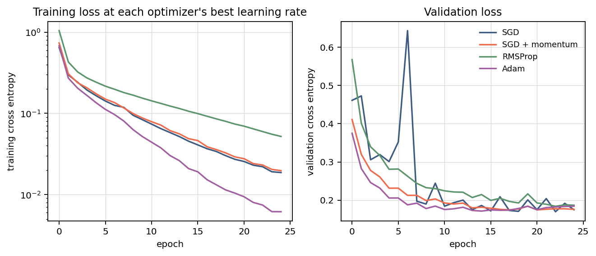

# mnist-mlp-numpy

A small neural network library written from scratch in NumPy. There is no autograd: the
backward pass for every layer is worked out by hand and written directly, then checked against
numerical gradients. On top of the library there are five scripts that train the network on
MNIST and compare it to standard scikit-learn models.

The network gets **98.26%** test accuracy on MNIST (95% bootstrap interval 98.00% to 98.50%),
training in 25 seconds on a laptop.

## How the backward pass works

A batch of inputs is a matrix `X` with one image per row. A dense layer computes `Z = A W + b`,
where `A` is whatever the previous layer produced. The thing worth tracking is the gradient of
the loss with respect to the layer's output, which I call `D`. Once you have it, the three
derivatives you need are:

```
dL/dW = A.T @ D          the input to the layer, transposed, times the incoming gradient
dL/db = D.sum(axis=0)    the same sum without the activation term
dL/dA = D @ W.T          what gets passed back to the previous layer
```

For an activation function the Jacobian is diagonal, so it turns into an elementwise multiply
by the derivative rather than a matrix product. That is the entire backward pass, and
`Dense.backward` in `mlp/layers.py` is those three lines.

Softmax and cross entropy are worth combining into one step. Written out, the loss for one
example is

```
loss = -z[y] + log(sum(exp(z)))
```

and differentiating the second term gives back the softmax, so the gradient is just
`p - y`, the predicted probabilities minus the one-hot label. Doing it this way means never
building the softmax Jacobian. Both directions subtract the row maximum before exponentiating,
otherwise large logits overflow.

## Results

### Training

784-256-128-10 with ReLU and dropout 0.2, trained with Adam and stopped early using a 10,000
image validation split. 235,146 parameters, 33 epochs.



At the epoch early stopping picks, training error is 0.47% and validation error is 1.76%. The
network fits the training data much better than the held-out data, which is what the dropout
and the early stopping are there to limit. Test error comes out at 1.74%, close to the
validation number, so the stopping rule does not look like it overfit the validation set.



Most of the mistakes are between digit pairs that genuinely look alike, and a lot of the images
it gets wrong are hard to read even for a person:



### Compared to scikit-learn models

All of these are trained on the same 50,000 images, and each one gets a setting tuned on the
same validation split the network used.

| model | test accuracy | 95% interval | time |
|---|---|---|---|
| neural network, 784-256-128-10 | **0.9826** | 0.9800 – 0.9850 | 25 s |
| random forest, 300 trees | 0.9702 | 0.9668 – 0.9734 | 30 s |
| k nearest neighbours, k=1 | 0.9677 | 0.9640 – 0.9709 | 24 s |
| logistic regression, C=0.1 | 0.9249 | 0.9197 – 0.9297 | 12 s |
| linear SVM, C=0.01 | 0.9169 | 0.9114 – 0.9223 | 22 s |
| majority class | 0.1135 | 0.1075 – 0.1194 | – |



The intervals do not overlap, but since every model is scored on the same 10,000 test images
the results are paired, so McNemar's test is the better check. Against the random forest, the
network is right on 181 images the forest gets wrong and wrong on 57 the forest gets right,
which gives a chi-squared of 63.6 and p of about 1e-15. Against 1-NN it is 228 to 79. The
difference is not just sampling noise.

### Checking the gradients

Since I wrote the derivatives by hand, they need to be verified. Each one is compared against
a central difference and all ten components agree to about 1e-10:

```
Dense                  4.56e-11  ok      SoftmaxCrossEntropy    1.49e-10  ok
ReLU                   1.63e-11  ok      MeanSquaredError       1.67e-10  ok
Tanh                   2.31e-11  ok      MLP 6-8-5-3            2.06e-10  ok
Sigmoid                7.91e-11  ok      MLP with dropout       8.57e-11  ok
Dropout(0.4)           2.60e-11  ok      MLP with tanh          1.54e-10  ok
```

The step size matters more than I expected. Too large and the difference quotient is not a
good approximation of the derivative; too small and subtracting two nearly equal numbers in
floating point destroys the answer. Sweeping it shows both effects, with the best value around
1e-5:



Two things tripped me up here. Dropout picks a new random mask on every forward pass, so the
two evaluations in the difference were not measuring the same function until I reset the
generator between them. And ReLU has a corner at zero while biases start at zero, so a unit
whose inputs are all dead sits exactly on the corner where the derivative is undefined and the
check fails for reasons that have nothing to do with the code being wrong.

### How much does network size matter

Trained on a smaller 10,000 image subset so overfitting is easier to see, three seeds per size.



I expected validation error to start climbing once the network was big enough to memorise the
training set. It does not. Training error hits zero at 128 hidden units, and validation error
keeps falling after that, from 4.88% to 4.06% at 1024 units. The gap between the two curves
grows, but the validation error itself does not get worse.

Regularization at a fixed 512 units turned out to be a smaller effect than size:



Dropout at 0.5 gives 3.84% against 4.19% with no regularization at all. L2 made it slightly
worse at both values I tried, 4.29% and 4.28%, which is not what I expected, though the gap is
only a few times the seed-to-seed spread so I would not read too much into the ordering.

### Optimizers

Comparing optimizers at a single learning rate is not really fair, since they do not all want
the same one, so each one gets its own sweep and the best is picked on validation loss.



Once tuned, they all end up close: 0.175 for SGD, 0.176 with momentum, 0.184 for Adam and
0.187 for RMSProp. What actually differs is which learning rates work at all. Counting the
rates that land within 10% of each optimizer's own best, Adam covers 3e-4 to 3e-3, SGD only
0.3 to 1.0, and RMSProp just one point on my grid. The best rates themselves are 300 times
apart, so most of the reason Adam looks better in a naive comparison is that a rate someone
picked for Adam is a terrible rate for SGD.



## What is in the code

`mlp/` only imports NumPy.

| file | contents |
|---|---|
| `layers.py` | `Dense`, `Dropout`, and the `Parameter` holding a weight and its gradient |
| `activations.py` | ReLU, tanh, sigmoid, softmax and log-softmax |
| `losses.py` | softmax cross entropy, mean squared error |
| `optimizers.py` | SGD with optional momentum, RMSProp, Adam, and a step decay schedule |
| `initializers.py` | He and Xavier scaling |
| `network.py` | the training loop, mini-batching, early stopping |
| `metrics.py` | accuracy, confusion matrix, bootstrap intervals, McNemar's test |
| `gradcheck.py` | numerical gradients for checking the analytic ones |
| `data.py` | loading MNIST and splitting off a validation set |

There are 42 tests in `tests/`. Besides the gradient checks, the ones I found most useful were
that He initialization keeps the activation variance roughly constant through six layers while
small random weights make it vanish, that dropout leaves the average of its input unchanged,
and that a network with one dense layer cannot separate a spiral that a two-layer network gets
to 97%.

## Running it

```
pip install -r requirements.txt
make test
make all
```

MNIST downloads from OpenML the first time and scikit-learn caches it, which takes about ten
seconds. Each script writes numbers to `results/` and figures to `figures/`, and both folders
are committed so the results above can be compared against a fresh run. Everything together
takes about nine minutes.

Individually:

```
python -m experiments.gradient_check
python -m experiments.train_mnist
python -m experiments.capacity
python -m experiments.optimizers
python -m experiments.baselines
```

`baselines` uses the predictions `train_mnist` saves, so that one has to run first.

## Notes

The validation split does double duty here, both for early stopping and for choosing
hyperparameters, which makes the validation numbers slightly optimistic. With 70,000 images
there was no real reason not to hold out a third split, and I would do that next time.

The capacity experiment only changes the width at a fixed depth. Depth is the more interesting
direction, but comparing depths fairly is harder because deeper networks are also harder to
train, so a worse result would not clearly mean less capacity was better.
